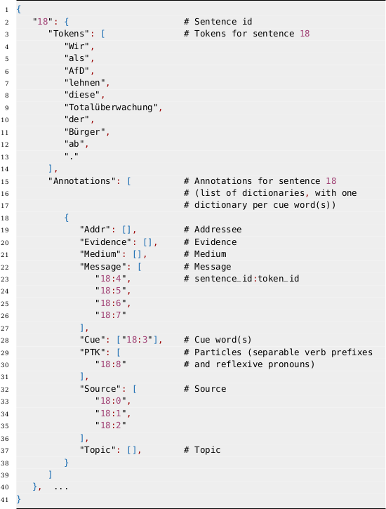

# SpkAtt-2023

This repository contains the data and supplementary materials for the 

## 2023 Shared Task on Speaker Attribution (SpkAtt-2023),

co-located with [KONVENS 2023](https://www.thi.de/konvens-2023/).

## Important dates:

 * April 1, 2023 - Training and development data release
 * June 15, 2023 - Test data release (blind)
 * July 1, 2023 - Submissions open
 * July 31, 2023 - Submissions close
 * August 14, 2023 - System descriptions due
 * September 7, 2023 - Camera-ready system paper deadline
 * September 18-22, 2023 - Workshop at KONVENS 2023

## Data format:

